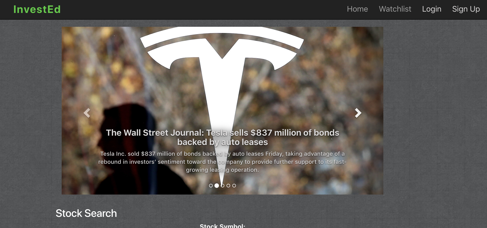

# InvestEd | 

## Link to Heroku : 
https://investmentappfinal.herokuapp.com/

## Video Demo:


## Overview
InvestEd is an educational app that offers an intuitive perspective with guidance on trading concepts, jargon, and latest stock position details. Users will be able to create their own account, search trending stocks and gain an understanding of complex terminology using our dictionary feature. Users will be able to find a company they're interested in and save the company's stock information to their own watchlist. 

## Developers
UNC Charlotte Full Stack Web Developer Program
<br>
FullGrant Fath, James Cresswell, Daniel Elston, Jonathan Gaghan, and Lauren Lapoint
<br>
<hr>
<br>

### App Home Page

<br><br>
### Stock Data Component

<br><br>
<hr>


## Technologies Used

* HTML5, CSS3, JavaScript (ES6)
* NodeJS, Express
* React, React Router
* React Boostrap
* Axios
* MongoDB, Mongoose
* Cheerio
* Firebase (login verfication)
* IEX API
* D3 (chart)
* Heroku

## Download This Application Locally

1. To use this application locally clone this repo to your local machine. 
2. Open the repo and execute the following in the bash terminal to install the app's dependencies: 
```
yarn install
```
3. Run the application from the command line:
```
yarn start:dev
```

## Future Developement
* Historical data component: you can search the price of stocks over the last few decades and see how much your investments would be today if you invested years ago. 
* Paper trading game: allow users to buy and sell stocks with a given amount of capital. 
* User interaction: allow users to compete against one another's portfolio. 

